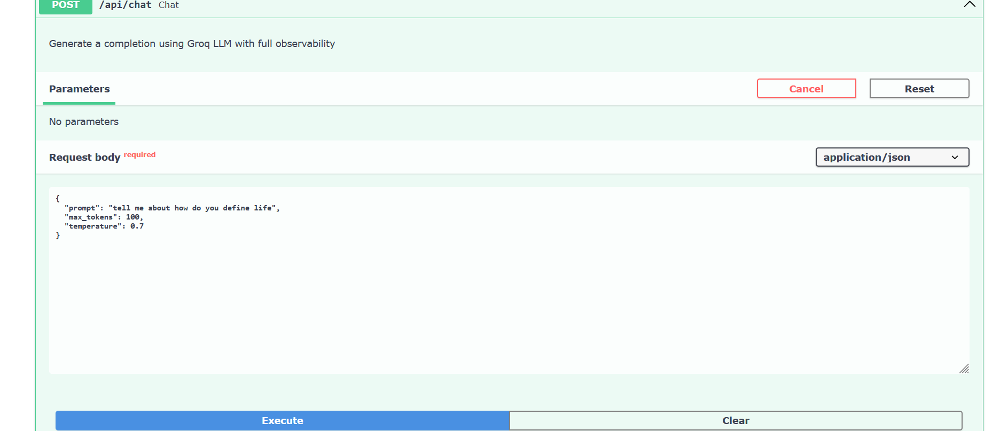
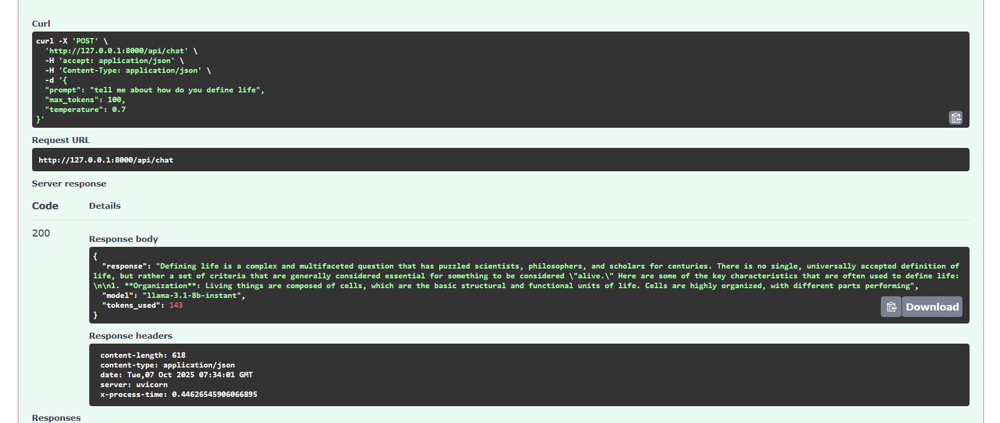
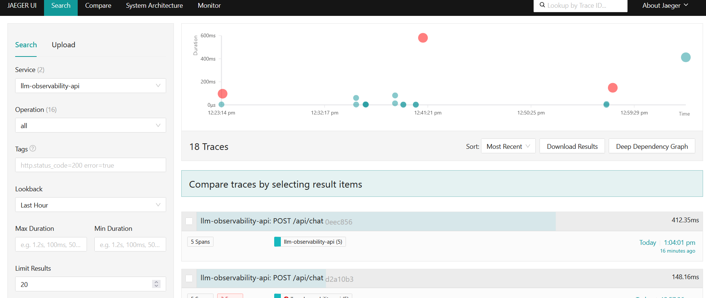
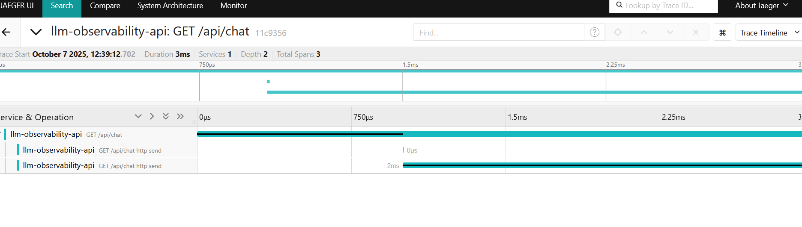

# LLM Observability Platform

A production-grade observability platform for Large Language Model applications, demonstrating distributed tracing, metrics collection, and real-time monitoring using OpenTelemetry, Jaeger, Prometheus, and Grafana.

## 🎯 Project Overview

This project showcases how to build comprehensive observability into LLM applications, tracking:
- **Request traces** across the entire application stack
- **Token usage and costs** per request
- **Latency breakdowns** to identify bottlenecks
- **Error rates and patterns** for reliability monitoring
- **Custom business metrics** for LLM-specific insights

##  Architecture

```
                        ┌────────────┐
                        │   Client   │
                        └─────┬──────┘
                              │
                              v
            ┌─────────────────────────────────────┐
            │        FastAPI Application          │
            │  ┌──────────────────────────────┐   │
            │  │   OpenTelemetry SDK          │   │
            │  │   - Auto-instrumentation     │   │
            │  │   - Custom spans & metrics   │   │
            │  └──────────────┬───────────────┘   │
            └─────────────────┼───────────────────┘
                              │
                  ┌──────────┴──────────┐
                  │                     │
                  v                     v
            ┌──────────────┐      ┌─────────────┐
            │ Groq LLM API │      │ OTEL        │
            │ (Mixtral)    │      │ Collector   │
            └──────────────┘      └──────┬──────┘
                                         │
                              ┌──────────┴──────────┐
                              │                     │
                              v                     v
                     ┌──────────┐         ┌────────────┐
                     │  Jaeger  │         │ Prometheus │
                     │ (Traces) │         │ (Metrics)  │
                     └──────────┘         └─────┬──────┘
                                                │
                                                v
                                          ┌──────────┐
                                          │ Grafana  │
                                          │(Dashboa  │
                                          └──────────┘
```

## 🚀 Features

### Distributed Tracing
- Full request tracing from API endpoint to LLM response
- Span attributes for LLM-specific data (model, tokens, temperature)
- Error tracking with exception details
- Context propagation across services

### Metrics Collection
- **Request counters** by model and status
- **Token usage tracking** per request and aggregate
- **Latency histograms** for performance analysis
- **Cost estimation** based on token usage

### Observability Tools
- **Jaeger UI**: Visualize traces and debug performance issues
- **Prometheus**: Time-series metrics storage
- **Grafana**: Custom dashboards for monitoring
- **OpenTelemetry Collector**: Central telemetry pipeline

## 📋 Prerequisites

- Docker Desktop (for Windows)
- Python 3.8+
- Git Bash (for Windows) or any terminal
- Groq API key (free tier: https://console.groq.com/)

## 🛠️ Installation

### 1. Clone the repository

```bash
git clone <your-repo-url>
cd LLM_obervebility
```

### 2. Set up environment variables

Edit `.env` file and add your Groq API key:

```bash
GROQ_API_KEY=gsk_your_actual_groq_key_here
OTEL_EXPORTER_OTLP_ENDPOINT=http://localhost:4318
```

### 3. Install Python dependencies

```bash
pip install -r requirements.txt
```

### 4. Start the observability stack

```bash
# Start Jaeger, Prometheus, Grafana, and OTEL Collector
docker-compose up -d

# Verify all containers are running
docker ps
```

### 5. Run the FastAPI application

```bash
python main.py
```

The API will be available at `http://localhost:8000`

## 📊 Access the Observability Stack

Once everything is running:

| Service | URL | Credentials |
|---------|-----|-------------|
| **FastAPI Docs** | http://localhost:8000/docs | - |
| **Jaeger UI** | http://localhost:16686 | - |
| **Prometheus** | http://localhost:9090 | - |
| **Grafana** | http://localhost:3000 | admin / admin |
| **Metrics Endpoint** | http://localhost:8001/metrics | - |

## 🧪 Testing the API

### Docker Running


### Using the Swagger UI

1. Go to http://localhost:8000/docs
2. Try the `/api/chat` endpoint
3. Send a request:
```json
{
  "prompt": "Explain observability in 3 sentences",
  "max_tokens": 100,
  "temperature": 0.7
}
```

### API Request Examples





### Using curl

```bash
curl -X POST "http://localhost:8000/api/chat" \
  -H "Content-Type: application/json" \
  -d '{
    "prompt": "What is OpenTelemetry?",
    "max_tokens": 100,
    "temperature": 0.7
  }'
```

### Using Python

```python
import requests

response = requests.post(
    "http://localhost:8000/api/chat",
    json={
        "prompt": "Explain LLM observability",
        "max_tokens": 100,
        "temperature": 0.7
    }
)

print(response.json())
```

## 🔍 Viewing Traces in Jaeger

1. Open http://localhost:16686
2. Select service: `llm-observability-api`
3. Click "Find Traces"
4. Click on any trace to see:
   - Request timeline
   - LLM call duration
   - Token usage
   - Model parameters
   - Any errors or exceptions

### Jaeger Trace Visualization





## 📈 Viewing Metrics

### Prometheus

1. Go to http://localhost:9090
2. Try these queries:
   - `llm_requests_total` - Total LLM requests
   - `llm_tokens_total` - Total tokens used
   - `rate(llm_requests_total[5m])` - Request rate per second

### Grafana (Optional)

1. Go to http://localhost:3000 (admin/admin)
2. Add Prometheus as data source:
   - URL: `http://prometheus:9090`
3. Create dashboards with:
   - Request rates
   - Token usage over time
   - Latency percentiles (p50, p95, p99)
   - Error rates

## 📁 Project Structure

```
LLM_obervebility/
├── api/
│   └── routes.py              # FastAPI endpoints
├── observability/
│   ├── __init__.py
│   ├── tracer.py             # OpenTelemetry trace setup
│   ├── metrics.py            # Custom metrics definitions
│   └── middleware.py         # Instrumentation middleware
├── services/
│   └── llm_service.py        # Groq LLM integration with tracing
├── docker-compose.yml         # All observability services
├── otel-collector-config.yml # OpenTelemetry Collector config
├── prometheus.yml            # Prometheus scrape config
├── main.py                   # Application entry point
├── requirements.txt          # Python dependencies
├── .env                      # Environment variables
└── README.md                 # This file
```

## 🎓 Key Concepts Demonstrated

### 1. OpenTelemetry Instrumentation
- Automatic FastAPI instrumentation
- Manual span creation for LLM calls
- Custom span attributes for business context

### 2. Distributed Tracing
- Request flow visualization
- Performance bottleneck identification
- Error propagation tracking

### 3. Metrics Collection
- Counters for aggregated counts
- Histograms for latency distributions
- Prometheus exposition format

### 4. Production Patterns
- Batch span processing for efficiency
- Graceful error handling
- Resource attribution (service name, version)

## 🔧 Troubleshooting

### Containers not starting

```bash
# Check logs
docker-compose logs

# Restart services
docker-compose down
docker-compose up -d
```

### API not connecting to OTEL Collector

- Check that `OTEL_EXPORTER_OTLP_ENDPOINT` in `.env` matches collector endpoint
- Verify collector is running: `docker ps | grep otel`

### No traces in Jaeger

- Wait 10-15 seconds for batch processing
- Check collector logs: `docker logs <otel-collector-container>`
- Verify FastAPI app is sending spans

### Groq API errors

- Verify your API key in `.env`
- Check rate limits (free tier has limits)
- Test key with: `python test_groq.py your_key_here`

## 🚀 Next Steps / Enhancements

- [ ] Add cost tracking and attribution
- [ ] Implement caching layer with Redis
- [ ] Add rate limiting
- [ ] Create Grafana dashboards
- [ ] Add alerting rules in Prometheus
- [ ] Implement multiple LLM providers
- [ ] Add prompt versioning
- [ ] Implement A/B testing framework
- [ ] Add evaluation metrics (hallucination detection)
- [ ] Create CI/CD pipeline

## 📚 Learn More

- [OpenTelemetry Documentation](https://opentelemetry.io/docs/)
- [Jaeger Documentation](https://www.jaegertracing.io/docs/)
- [Prometheus Documentation](https://prometheus.io/docs/)
- [FastAPI Documentation](https://fastapi.tiangolo.com/)
- [Groq API Documentation](https://console.groq.com/docs)

## 🤝 Contributing

This is a portfolio project demonstrating observability best practices for LLM applications. Feel free to fork and adapt for your needs!

## 📄 License

MIT License - feel free to use this for learning and portfolio purposes.

## 👤 Author

Built as part of a portfolio demonstrating AI infrastructure engineering skills.

**Skills demonstrated:**
- Distributed systems observability
- OpenTelemetry instrumentation
- Production monitoring setup
- LLM API integration
- Docker containerization
- Python backend development

---

**⭐ If you found this helpful, please star the repo!**
